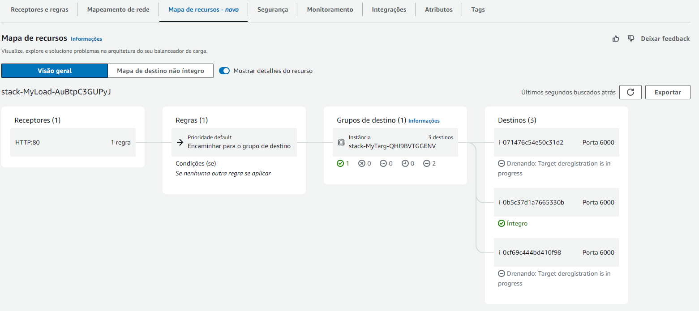
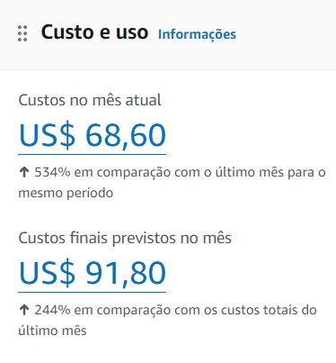

# Relatório do Projeto Final Cloud

**Aluno:** Caio Ortega Boa  
**Rúbrica Alvo:** B+  

## Sumário

- Contextualização e Diagrama
- Operacionalização
- Explicação da Infraestrutura
- Análise de Custos

## Contextualização e Diagrama

Este relatório abrange a documentação técnica de um projeto que implementa uma arquitetura escalável na AWS utilizando FastAPI para servir uma aplicação web e Locust para realização de testes de carga. O projeto envolve o uso de serviços como Amazon EC2, Auto Scaling Groups, Elastic Load Balancing (ELB), e Amazon DynamoDB.

## Operacionalização

### Pré Requisitos: AWS CLI e Locust

- **AWS CLI**  
  Siga as instruções do site oficial para seu sistema operacional. [LINK](https://docs.aws.amazon.com/cli/latest/userguide/getting-started-install.html)

- **Configuração da AWS CLI**
    Para configurar a AWS CLI, digite a seguinte linha de comando em um terminal:
    ```bash
    aws configure
    ```
    Será solicitado o preenchimento de suas credenciais da AWS, que podem ser obtidas através do console da AWS.

- **Locust**  
  Para instalação do Locust, digite a seguinte linha de comando em um terminal:
  ```bash
  pip install locust
    ```

Considerando que os pré requisitos para utilização do serviço tenham sido atendidos, a operacionalização do projeto se dará da seguinte forma:

1. Primeiramente clonar o repositório em um diretório próprio de sua máquina.
2. Lembre-se de estar no mesmo diretório do arquivo .yaml para utilizar os comandos.

**Criar Stack**
```bash
aws cloudformation create-stack --stack-name stack --template-body file://stack.yaml --capabilities CAPABILITY_IAM
```
**Obter DNS Name**
```bash
aws cloudformation describe-stacks --stack-name stack --query "Stacks[0].Outputs[?OutputKey=='LoadBalancerDNSName'].OutputValue" --output text
```
O valor retornado deverá ser utilizado sempre que for referido `<DNS-NAME>` em algum comando.

**Atualizar Stack**
```bash
aws cloudformation update-stack --stack-name stack --template-body file://stack.yaml --capabilities CAPABILITY_IAM
```
**Apagar Stack**
```bash
aws cloudformation delete-stack --stack-name stack
```

A infraestrutura pode demorar alguns minutos até estar efetivamente ativa, mesmo após a confirmação de criação da stack, devido a certo atraso para instalação da infraestrutura nas EC2.

A documentação completa da aplicação poderá ser visualizada através de seu navegador web através do link:
`<DNS-NAME>/docs`

Tal acesso te encaminhará a documentação FAST API do projeto, contando com APIS para criação e leitura de items na base de dados, além de um exemplo de requisição com retorno HTML que pode ser acessado via Browser.

Através da documentação FAST API, requisições para as máquinas EC2 podem ser realizadas a sua preferência seguindo as rotas e especificações da documentação.

As requisições de criação e leitura podem ser validadas através da própria interface *Docs* da FastAPI, mas caso deseje realizar as requisições de outra forma as mesmas podem ser testadas utilizando de serviços como PostMan ou Curl.

Segue abaixo exemplos de requisições de Post via curl e powershell para criação de um item na base de dados:

**PowerShell**
```powershell
Invoke-WebRequest -Uri "<DNS-NAME>/create_item" -Method Post -ContentType "application/json" -Body '{"YourPrimaryKey": "1", "name": "New Item"}'
```

**Curl**
```bash
curl -X POST "<DNS-NAME>/create_item" -H "Content-Type: application/json" -d "{"YourPrimaryKey": "1", "name": "New Item"}"
```

### Locust

Para utilização do teste de carga basta utilizar o seguinte comando no terminal do diretório do projeto:

```bash
locust --host <DNS-NAME>
```

O DNS Name também pode ser inserido dentro da interface gráfica do Locust caso seja mais conveniente.

Nesse caso, utilizar apenas o seguinte comando:

```bash
locust
```

Após a inicialização, acessar a página da interface gráfica via [localhost:8089](http://localhost:8089) para visualização do teste de carga.

Dentro da interface gráfica, selecione o número máximo de usuários e o ramp up de usuários para visualizar o desempenho da api nas especificações requeridas.

Para validação do Auto Scalling Group, selecione cerca de 400 usuários, preferencialmente com ramp-up alto, e aguarde por volta de 2 minutos para observar a criação da nova instância EC2.

As novas criação das novas instâncias EC2 podem ser observadas através do console da AWS, através do seguinte caminho:
`CloudFormation -> Stack -> Recursos -> <ID-Físico-LoadBalancer> -> <Nome-LoadBalancer> -> Mapa de Recursos`
E visualizando a quantidade de destinos saudáveis.

Exemplo de visualização de teste de carga:


## Explicação da Infraestrutura

### VPC (Virtual Private Cloud)

A VPC funciona como uma rede virtual privada dentro da rede AWS, utilizada pra comportar apenas as suas entidades e permitir ligações diretas entre as mesmas.

- **Propriedades:**
  - `CidrBlock: 10.0.0.0/24` define um espaço de endereço IP privado, permitindo até 256 endereços IP na rede.
  - `EnableDnsSupport: true` e `EnableDnsHostnames: true` permitem a resolução de DNS dentro da VPC e a atribuição de nomes DNS aos recursos.

### Subnets

As Subnets subdividem a VPC em redes menores que podem ser alocadas em diferentes zonas de disponibilidade, prevenindo falhas.

- **Propriedades:**
  - Localizadas em zonas de disponibilidade distintas (us-east-1a e us-east-1b), aumentando a resiliência.
  - `MapPublicIpOnLaunch: true` permite que instâncias recebam um IP público automaticamente, facilitando a comunicação externa.
  - `CidrBlock: 10.0.0.0/28` define um espaço de endereço IP privado, permitindo até 16 endereços IP na rede.

### Internet Gateway

O Internet Gateway funciona como um roteador da VPC criada, permitindo que as instâncias se conectem à internet.

### Route Table

A Route Table define as regras de roteamento para a VPC, definindo quais recursos podem se comunicar com a internet e quais ips podem ser acessados.

### Public Route

A Public Route complementa a Route Table, criando uma rota que define com quais ips os recursos da VPC podem se comunicar e para qual recurso tal comunicação será direcionada.

- **Propriedades:**
  - `DestinationCidrBlock` 0.0.0.0/0 indica que essa rota se aplica a qualquer IP externo.
  - `GatewayId` é o ID do Internet Gateway, sinalizando a porta de saída para a internet.

### Security Group

O Security Group é um firewall virtual que controla o tráfego de entrada e saída das instâncias, permitindo ou bloqueando conexões.

Na infraestrutura gerada foram criados dois Security Groups, um para a instância EC2 e outro para o Dynamo DB, um permitindo acesso as portas 80, 6000 e 22 das instâncias EC2, e outro possibilitando apenas acessos na porta 443 do Dynamo DB por recursos dentro do primeiro security group.

- **EC2 Security Group Propriedades**
    - `SecurityGroupIngress` permite tráfego de entrada nas portas 80, 6000 e 22.
    - `CidrIp` permite que qualquer IP externo acesse as portas especificadas.

- **DynamoDB Security Group Propriedades**
    - `SecurityGroupIngress` permite tráfego de entrada na porta 443.
    - `SourceSecurityGroupId` permite que apenas recursos com o Security Group ID especificado acessem a porta.

### Launch Configuration

O Launch Configuration é uma configuração que define as propriedades das instâncias EC2 que serão criadas pelo Auto Scaling Group, no caso a aplicação FastAPI utilizada é instalada e configurada através da propriedade `UserData`.

- **Propriedades:**
    - `InstanceType` define a capacidade computacional das instâncias a serem criadas.
    - `KeyName` define a chave de acesso ssh para a instância (necessária apenas para manutenção e debug).
    - `SecurityGroups` define o Security Group a ser associado à instância.
    - `UserData` realiza toda a configuração da instância, que foi realizada em 3 etapas:
        - Instalação do FastAPI e criação do arquivo de aplicação
        - Instalação e configuração do gunicorn, serviço que mantém aplicação ativa para servidor
        - Instalação e configuração do nginx, serviço que redireciona tráfego para aplicação
    - `ImageId` define a imagem da instância a ser criada, no caso uma imagem Amazom Linux 2023.
    - `IamInstanceProfile` referencia o IAM ROLE da instância, permitindo a inicialização das credenciais nas instâncias EC2 para utilização do banco de dados em aplicações com o Boto3.

### Auto Scaling Group

O Auto Scaling Group é um grupo de instâncias EC2 que são escaladas automaticamente de acordo com a demanda, permitindo a adição ou remoção de instâncias conforme a necessidade.

- **Propriedades:**
    - `MinSize` e `MaxSize` definem a quantidade mínima e máxima de instâncias que o Auto Scaling Group pode ter.
    - `DesiredCapacity` define a quantidade de instâncias que o Auto Scaling Group deve ter inicialmente e preferencialmente deverá tentar manter.
    - `LaunchConfigurationName` define a configuração de lançamento a ser utilizada para criar as instâncias.
    - `TargetGroupARNs` define o Target Group a ser associado ao Auto Scaling Group, permitindo o balanceamento de carga entre as instâncias.

### Load Balancer

O Load Balancer é um serviço que distribui o tráfego entre as instâncias EC2, permitindo a escalabilidade e a alta disponibilidade da aplicação.

- **Propriedades:**
    - `Scheme` define o esquema de balanceamento de carga, no caso `internet-facing` pois receberá requisições da internet.
    - `LoadBalancerAttributes: idle_timeout.timeout_seconds` define o tempo máximo de inatividade de uma conexão, no caso foi alterado para 30 visando economia de recursos para uma aplicação não muito demandante.

### Target Group

O Target Group sinaliza para o Load Balancer quais instâncias EC2 estão disponíveis para receber tráfego, permitindo o balanceamento de carga entre as instâncias, além de realizar testes para verificar a saúde das instâncias, por padrão, esperando uma resposta HTTP 200.

- **Propriedades:**
    - `Port` define a porta que o Load Balancer utilizará para se comunicar com as instâncias, no caso foi utilizada a 6000.
    - `Protocol` define o protocolo de comunicação entre o Load Balancer e as instâncias, no caso protocolo HTTP.
    - `VpcId` define a VPC a qual o Target Group pertence.
    - `HealthCheckPath` define o caminho que o Load Balancer utilizará para verificar a saúde das instâncias.
    - `HealthCheckProtocol` define o protocolo de comunicação que o Load Balancer utilizará para verificar a saúde das instâncias.
    - `HealthCheckPort` define a porta que o Load Balancer utilizará para verificar a saúde das instâncias, no caso 6000 novamente.
    - `HealthCheckIntervalSeconds` define o intervalo de tempo entre as verificações de saúde das instâncias.
    - `HealthCheckTimeoutSeconds` define o tempo máximo de espera para uma resposta da instância.
    - `HealthyThresholdCount` define o número de verificações consecutivas que devem ser bem-sucedidas para que a instância seja considerada saudável.
    - `UnhealthyThresholdCount` define o número de verificações consecutivas que devem falhar para que a instância seja considerada não saudável.
    - `TargetType` define o tipo de instância que o Target Group irá monitorar, no caso instâncias EC2.

### Listener

O Listener define as regras de encaminhamento de tráfego para as instâncias EC2, permitindo a comunicação entre o Load Balancer e as instâncias.

- **Propriedades:**
    - `Port` define a porta que o Load Balancer utilizará para se comunicar com as instâncias, no caso foi utilizada a 80.
    - `Protocol` define o protocolo de comunicação entre o Load Balancer e as instâncias, no caso protocolo HTTP.
    - `DefaultActions` define a ação padrão a ser tomada quando uma requisição é recebida, no caso encaminhar a requisição para o Target Group.

### Scaling Policies

Os Scaling Policies são políticas que definem como o Auto Scaling Group deve se comportar em relação à demanda, permitindo a adição ou remoção de instâncias conforme a necessidade.

- **Propriedades:**
    - `AdjustmentType` define o tipo de ajuste a ser realizado, no caso `ChangeInCapacity` que adiciona ou remove instâncias.
    - `ScalingAdjustment` define a quantidade de instâncias a serem adicionadas ou removidas, no caso 1 ou -1.
    - `Cooldown` define o tempo de espera entre a execução de uma política e a execução da próxima, no caso 30 segundos.

### Alarms

Os Alarms são notificações que alertam sobre o estado de recursos da AWS, permitindo a execução de ações automáticas em resposta a eventos, como a chamada dos Scaling Policies, que foi o recurso utilizado nessa infraestrutura.

- **Propriedades:**
    - `MetricName` define a métrica a ser monitorada, no caso `CPUUtilization` que monitora a utilização da CPU.
    - `Namespace` define para qual tipo de instância a checagem será realizada, no caso `AWS/EC2`.
    - `Statistic` define a estatística a ser utilizada para medição do gasto da CPU, no caso a foi utilizada a média durante o período definido.
    - `Period` define o intervalo de tempo entre as medições para captação da média.
    - `EvaluationPeriods` define o intervalo entre as análises da métrica para a tomada de decisão.
    - `Threshold` define o valor limite para a métrica, no caso 10% para criação e 2% para remoção de máquinas.
    - `ComparisonOperator` define o operador de comparação a ser utilizado, no caso `GreaterThanThreshold` e `LessThanThreshold`.
    - `AlarmActions` define a ação a ser tomada quando a métrica ultrapassa o limite, no caso a chamada de uma Scaling Policy.
    - `Dimensions` define o recurso em que as medições serão realizadas, no caso as instâncis EC2 do Auto Scaling Group.

### DynamoDB Table

O DynamoDB é um banco de dados NoSQL totalmente gerenciado pela AWS, que fornece desempenho rápido e escalabilidade automática. Tal entidade cria uma tabela no DynamoDB para ser consumida pela aplicação das instâncias EC2.

- **Propriedades:**
    - `AttributeDefinitions` define alguns atributos da tabela, o qual somente foi definido atributo `YourPrimaryKey` como chave primária, sendo do tipo String.
    - `KeySchema` define a chave primária da tabela e seu tipo, no caso `YourPrimaryKey` é uma chave que se comporta como um Hash.
    - `BillingMode` define o modo de cobrança pelo uso da tabela, no caso por se tratar de uma aplicação pouco requisitada, foi utilizado `PayPerRequest`.
    - `TableName` define o nome da tabela.
    - `TableClass` foi definido como `STANDARD_INFREQUENT_ACCESS` visto que se trata de uma API pouco consumida, visando reduzir custos.

### Role e Instance Profile

As entidades Role e Instance Profile são utilizadas para conceder permissões a instâncias EC2 para acessar recursos da AWS, no caso o DynamoDB, permitindo que as instâncias consumam a base de dados em suas aplicações.

- **Propriedades:**
    - `AssumeRolePolicyDocument` define a política que permite que a instância assuma a Role.
    - `Policies` define as permissões que a instância terá ao assumir a Role, concedendo acesso ao DynamoDB.

### VPC Endpoint

Como o Dynamo DB é um serviço que opera fora da VPC privada gerada, não é possível atribuir um Security Group diretamente a ele, gerando falhas de segurança. Para resolver tal problema, foi criado um VPC Endpoint, que realiza conexões privadas entre a VPC e demais serviços AWS, possibilitando a atribuição de regras de segurança a tais comunicações.

- **Propriedades:**
    - `ServiceName` define o serviço ao qual o VPC Endpoint se conectará, no caso `com.amazonaws.${AWS::Region}.dynamodb`.
    - `VpcId` define a VPC a qual o VPC Endpoint pertence.
    - `SecurityGroupId` define o Security Group a ser associado ao VPC Endpoint, permitindo a comunicação apenas com recursos autorizados.

## Análise de Custos

### Custo Real

Considerando a análise do billing, estimando que os projetos dos dois alunos, por executarem estruturas com mesmo objetivo, possuem custos similares, pode-se inferir que o custo mensal de cada projeto seria de aproximadamente 46,00 US$ por mês, considerando um custo previsto de 91,80 US$ por mês da conta como um todo.



### Custo Estimado

Após a análise do projeto, considerando um uso de 200 requisições por hora e um banco de dados capaz de armazenar cerca de 10000 itens com cerca de 50 bytes cada e todas as demais propriedades seguindo o modelo as quais seria criadas utilizando o arquivo .yaml do projeto, o custo estimado do projeto resultou em 85,49 US$ por mês.

Apesar de tal valor ser consideravelmente maior que o custo real, existem fatores que argumentam a favor da diferença, como:
    - Carga de 200 requisições por hora, que é expressivamente maior que a carga no qual o projeto vem sendo testado.
    - Armazenamento de 10000 itens, que é um valor muito maior que o armazenamento atual do banco de dados, contando com no máximo 10 items.

A análise detalhada do custo pode ser visualizada no seguinte [LINK](https://calculator.aws/#/estimate?id=d2052c76fe3048c8f407070ecefa805704c1bdc3) ou no pdf [Estimativa de Custos](EstimativaDeCustos.pdf) encontrado no diretório do projeto.

### Principais Gastos e Otimizações

Os principais gastos da infraestrutura se dão pelo DynamoDB, Load Balancer e VPC, que juntos representam cerca de 95% do custo total do projeto.

A principal otimização encontrada para os custos do projeto se deu pelo uso da classe `STANDARD_INFREQUENT_ACCESS` para a tabela do DynamoDB, que aprsentou uma perspectiva de redução de até 61% em relação à classe `STANDARD`, com um custo que variou de 129,68 US$ para 50,12 US$.

Tal otimização só foi possível devido a perspectiva de baixo consumo do banco de dados da aplicação, uma vez que tal configuração otimiza o custo para aplicações de baixo consumo de banco de dados.

